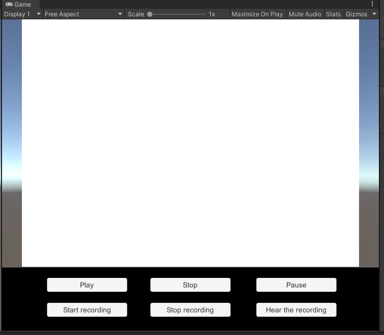
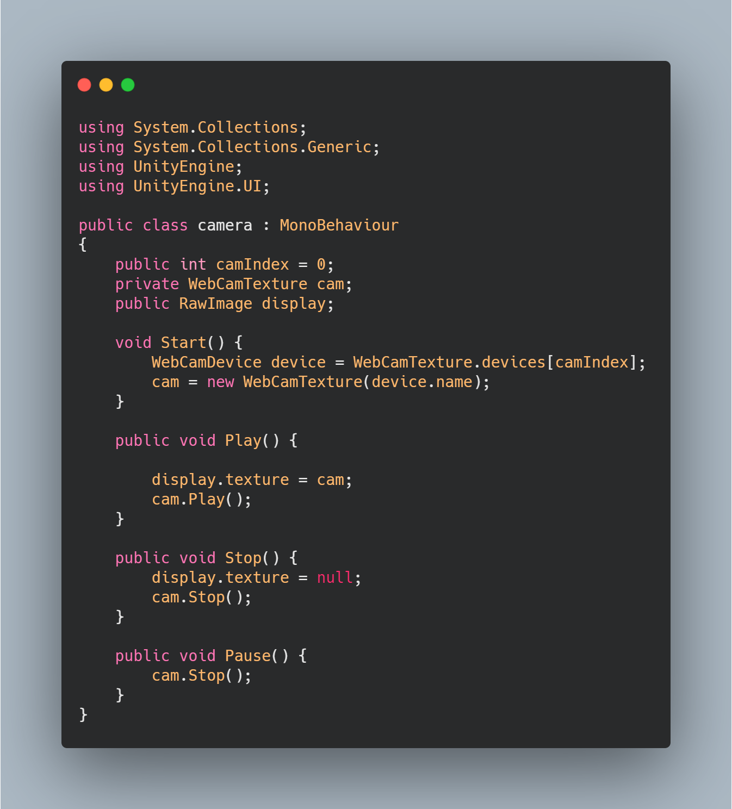
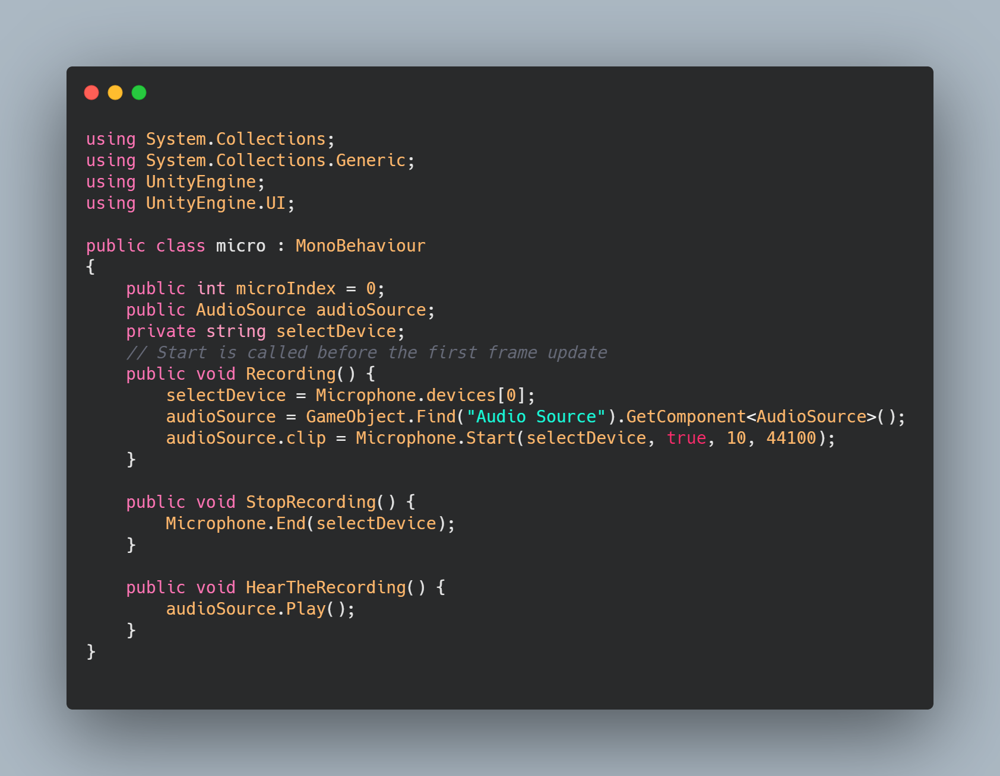
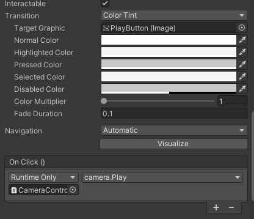

# Práctica 4. Interfaces naturales

Mi práctica consiste en una interfaz sencilla que te muestra lo que ve la cámara y además puede parar la imagen. También dispone de algunas funciones con el micro, como es realizar una grabación y reproducir la grabación.

## Interfaz

## Script de la cámara

Básicamente lo que hace es captura los frame de la cámara y a través de un RawImage que es la ventana blanca que se muestra en la interfaz, los va mostrando asignandoselos. Esto es posible ya a la textura del RawImage le asignamos el WebCamTexture que son las texturas en las que se procesa la entrada de video en vivo.

## Script del micro

Básicamente lo que hace es buscar el micro, buscar la fuente de audio en la escena y luego según el método que utilice graba, para de grabar o reproduce la grabación

## Eventos en los botones de la interfaz

Mi interfaz en un canvas que tiene una serie de elementos: botones, un panel y un RawImage.

Pues los botones desde el inspector se le puede asignar un evento onclick como podemos ver en la siguiente imagen:

## Muestra de la interfaz

## Video de la prueba

https://drive.google.com/file/d/1GuVqEv2SkgAj3nAwWEKtyhfMe8Mc2T_0/view?usp=sharing

## Bibliografía 
- https://docs.unity3d.com/ScriptReference/AudioSource.Stop.html
- Informe de la práctica
- https://www.youtube.com/watch?v=vtM-kqaTUso

